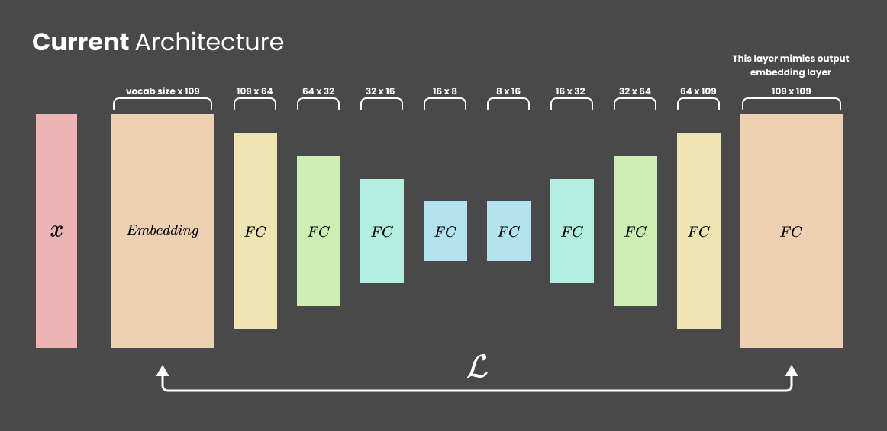

> Disclaimer: This README more like experiments log than an actual README

### General Idea

1. Train autoencoder
2. Make a latent dim representation for all corpus
3. Cluster with K-Means
4. Apply PCA and compress it until 2D
5. Viz!

### I did an oopsie 😵

> 17 Jan 2023

Currently I vectorize the text into dense representation with BoW which is the number generated is an index from the BoW dictionary. If I cluster the dense representation, it will calculate the distance beetwen a particular word with other word IN THE DICTIONARY (not the semantic similiarity). Oopsie, the dictionary is made randomly and of course the cluster will mean nothing.

How to overcome this? I need word embeddings. The problem is I still don't understand how to perform the "decoder part" when training. I think I need to somehow convert from decoder embedding layer into indices/dense representation (no?) to be able to calculate the MSE loss. Or should I just calculate the loss between input embedding vs output embedding? I think the second option more promising.

### I did another oopsie!

> 18 Jan 2023

As I mention yesterday, instead of clustering the dense representation, we have to use embedding layer so the net will learn about semantic similiarity. We interested to cluster this similiarity. I figure it out how to train the net especially the "decoder part". I ended up using FC layer that mimics embedding output. So, the architecture will look like this:

But the loss is peculiar. It is to good to be true...

I don't really know what's wrong but I suspect something: My encoder embedding layer is not learning any semantic similiarity. Why? It's because the decoder is trying to produce a weight that will end up the same with the input embedding, so the input embedding is not updating that much. What I learn from this? don't calculate the loss of a dynamic (trainable or in progress of training) true value.

I think I can fix this by not calculating the loss of dynamic true value. I will put my embedding outside of the architecture and use pretrained embedding layer so we'll get the semantic similiarity.